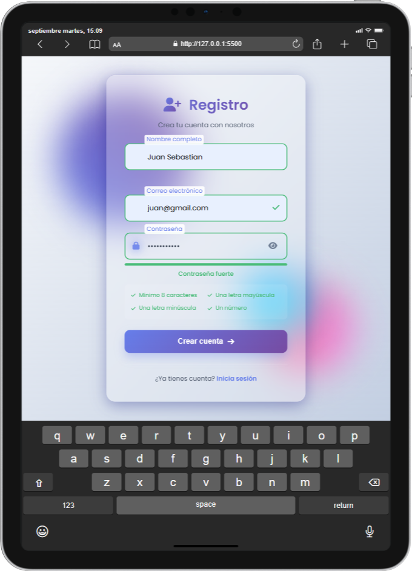

# 📝 Formulario de Registro - Proyecto de Programación Web

## 📋 Descripción del Proyecto

Este es un **formulario de registro básico** desarrollado como proyecto para la asignatura de **Programación Web** de la **Universidad Libre**. El proyecto implementa un formulario moderno y responsivo con validaciones en tiempo real, diseñado con las mejores prácticas de desarrollo web.

## 👨‍💻 Desarrollador

**Juan Sebastián Quinto**  
Estudiante de Programación Web - Universidad Libre

## 🚀 Características Principales

### ✨ Interfaz de Usuario
- **Diseño moderno** con efecto glassmorphism
- **Fondo animado** con elementos flotantes (blobs)
- **Responsive design** que se adapta a diferentes dispositivos
- **Animaciones suaves** y transiciones elegantes
- **Iconografía** con Font Awesome

### 🔐 Validaciones Implementadas
- **Validación de nombre**: Solo letras, mínimo 2 caracteres
- **Validación de email**: Formato correcto con regex
- **Validación de contraseña**: 
  - Mínimo 8 caracteres
  - Al menos una letra mayúscula
  - Al menos una letra minúscula
  - Al menos un número
  - Indicador visual de fortaleza de contraseña

### 🎯 Funcionalidades
- **Validación en tiempo real** mientras el usuario escribe
- **Mensajes de error** específicos y claros
- **Indicadores visuales** de estado (éxito/error)
- **Toggle para mostrar/ocultar** contraseña
- **Medidor de fortaleza** de contraseña en tiempo real
- **Botón de envío** que se habilita solo cuando todos los campos son válidos

## 🛠️ Tecnologías Utilizadas

- **HTML5**: Estructura semántica del formulario
- **CSS3**: 
  - Variables CSS (Custom Properties)
  - Flexbox y Grid Layout
  - Animaciones y transiciones
  - Efectos glassmorphism
  - Media queries para responsive design
- **JavaScript (ES6+)**:
  - Validaciones en tiempo real
  - Manipulación del DOM
  - Event listeners
  - Regex para validaciones
  - Intersection Observer API

## 📁 Estructura del Proyecto

```
formulario/
├── index.html              # Página principal del formulario
├── assets/
│   ├── css/
│   │   ├── styles.css      # Estilos principales
│   │   └── styles(1).css   # Archivo de respaldo
│   ├── js/
│   │   ├── script.js       # Lógica JavaScript principal
│   │   └── script(1).js    # Archivo de respaldo
│   └── img/
│       └── iPad-PRO-11-127.0.0.1.png  # Captura de pantalla del proyecto
└── README.md               # Este archivo
```

## 📸 Captura de Pantalla



*Vista del formulario de registro en funcionamiento*

## 🚀 Cómo Ejecutar el Proyecto

1. **Clonar o descargar** el proyecto
2. **Abrir** el archivo `index.html` en cualquier navegador web moderno
3. **¡Listo!** El formulario estará funcionando

### Requisitos del Sistema
- Navegador web moderno (Chrome, Firefox, Safari, Edge)
- No requiere servidor web (funciona con file://)

## 📱 Compatibilidad

- ✅ **Desktop**: Chrome, Firefox, Safari, Edge
- ✅ **Tablet**: iPad, Android tablets
- ✅ **Mobile**: iOS Safari, Chrome Mobile, Samsung Internet

## 🎨 Características de Diseño

### Paleta de Colores
- **Primario**: Gradiente azul-púrpura (#667eea → #764ba2)
- **Secundario**: Gradiente rosa (#f093fb → #f5576c)
- **Fondo**: Gradiente suave (#f5f7fa → #c3cfe2)
- **Éxito**: Verde (#48bb78)
- **Error**: Rojo (#f56565)
- **Advertencia**: Naranja (#ed8936)

### Tipografía
- **Fuente principal**: Poppins (Google Fonts)
- **Pesos**: 300, 400, 500, 600

## 🔧 Funcionalidades Técnicas

### Validaciones Implementadas
```javascript
// Patrones de validación
const emailPattern = /^[a-zA-Z0-9._%+-]+@[a-zA-Z0-9.-]+\.[a-zA-Z]{2,}$/;
const strongPasswordPattern = /^(?=.*[a-z])(?=.*[A-Z])(?=.*\d)(?=.*[@$!%*?&])[A-Za-z\d@$!%*?&]{8,}$/;
```

### Estados del Formulario
- **Validación en tiempo real** con feedback visual
- **Estado del botón** que se actualiza dinámicamente
- **Mensajes de error** contextuales
- **Indicadores de éxito** para campos válidos


